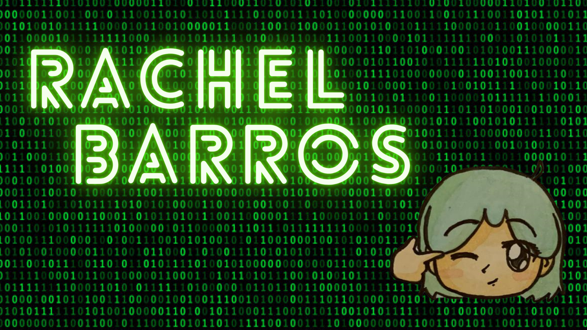

 

# Quem é Rachel?

* Estudante de Análise e Desenvolvimento de Sistemas.
* Me aventurando pelo mundo do desenvolvimento Android.
* Psicológa Clínica.

## Ultimamente tenho me interessado por :

 

	

## Você pode me encontrar:

